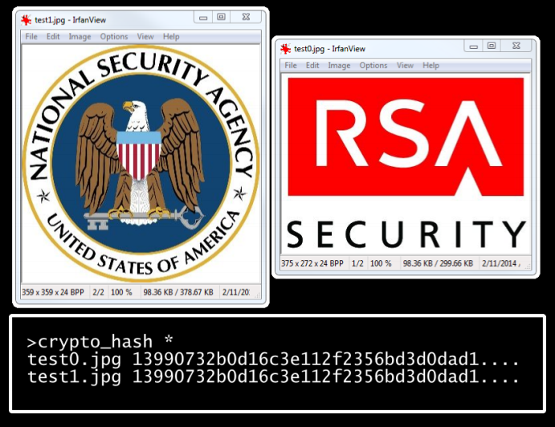
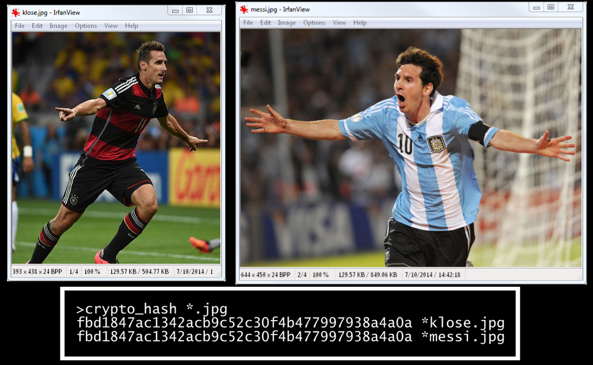
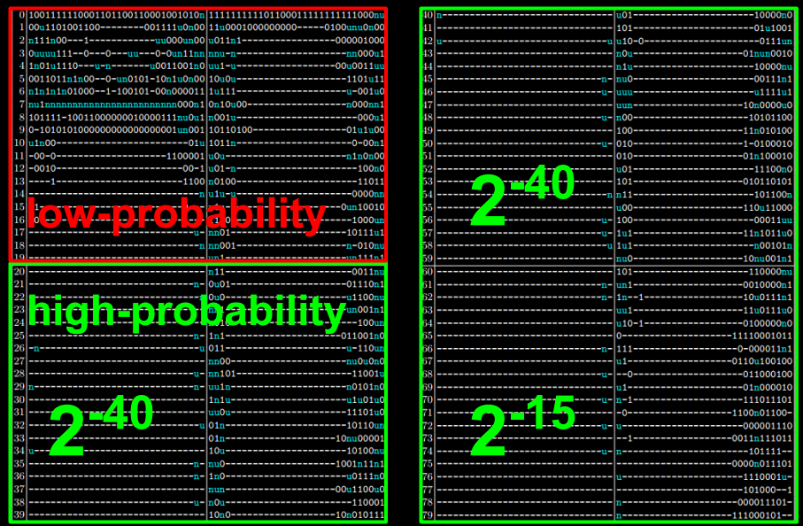
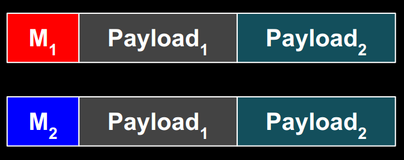
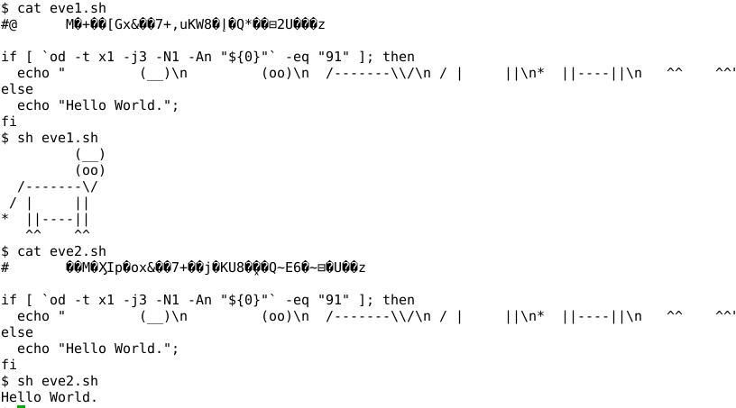
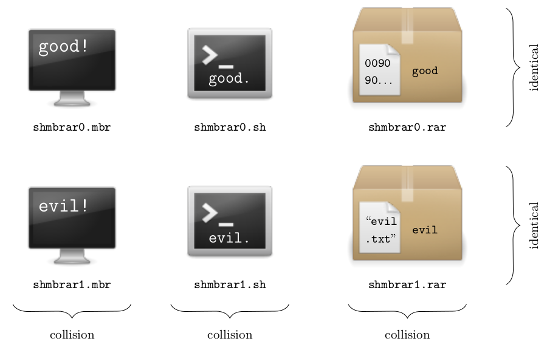

% Malicious SHA-1

<nav>

<big>
<b>
<a href="#summary">Summary</a>
&nbsp;&nbsp;
<a href="#authors">Authors</a>
&nbsp;&nbsp;
<a href="#details">Details</a>
&nbsp;&nbsp;
<a href="#downloads">Downloads</a>
&nbsp;&nbsp;
<a href="#faq">FAQ</a>
</b>
</big>

</nav>

_**TL;DR**: If the four 32-bit constants of SHA-1 can be modified, then
exploitable collisions can be constructed. No need to panic, this
doesn't affect the original SHA-1. However, vendors and customers of
products with custom cryptography will be interested._

## Summary

This is the webpage of the Malicious SHA-1 project, a research project
that demonstrates how the security of the
[SHA-1](http://en.wikipedia.org/wiki/SHA-1) hashing standard can be
**fully compromised** if one slightly tweaks some of the predefined
constants in the SHA-1 algorithm.
That is, we show that systems using "custom" versions of SHA-1 may
include backdoors exploitable by the designers.
Such custom versions of cryptographic standards are typically found in
proprietary systems as a way to personalize the cryptography for a given
customer, while retaining the security guarantees of the original
algorithm.

The colliding messages constructed can be valid archives files (RAR or
7zip) such that the content of the two archives can be fully controlled.
We also build colliding JPEG files, which can be any two images, as in
the example below (images were chosen at random): 

We can also construct **colliding executables**, with MBR (Master Boot
Record) or COM files including arbitrary code.
Furthermore, we present **polyglot** malicious SHA-1 instances, that is,
for which the designer can create
colliding files of different types with arbitrary content (for example:
any two MBR's, any two RAR archives, and any two shell scripts)

The Malicious SHA-1 project was presented in 2014 at the following
security and cryptography conferences:

* BSidesLV (Aug 5; Las Vegas, USA)
* DEF CON Skytalks (Aug 9; Las Vegas, USA)
* Selected Areas in Cryptography (Aug 14-15 Montreal Canada)

Implications of this research are discussed in our [FAQ](#faq). 
More details are given [below](#details), and a full description of our
work is reported in the [research paper](#downloads).

## Authors 

The Malicious SHA-1 project is a joint work of

* [Ange Albertini](https://code.google.com/p/corkami/) (Corkami, Germany)
* [Jean-Philippe Aumasson](https://131002.net) (Kudelski Security,
  Switzerland)
* [Maria
  Eichlseder](http://www.iaik.tugraz.at/content/about_iaik/people/eichlseder_maria/) (Graz University of Technology, Austria)
* [Florian
  Mendel](http://www.iaik.tugraz.at/content/about_iaik/people/mendel_florian/) (Graz University of Technology, Austria)
* [Martin
  Schlaeffer](http://www.iaik.tugraz.at/content/about_iaik/people/alumni_schlaeffer_martin/index.php) (Graz University of Technology, Austria)

To contact us, please use the address <a
href="mailto:malicioussha1@131002.net">malicioussha1@131002.net</a>.

## Details

The security of a cryptographic hash function such as SHA-1 relies on
the practical impossibility of finding collisions, that is, distinct
messages having the same hash value.
Denoting the hash function _H_, a collision is thus a pair of distinct
messages M1 and
M2 such that _H_(M1) = _H_(M2).

### SHA-1

SHA-1 is a NIST standard designed by NSA in 1995 and used everywhere:
in TLS, SSH, IPsec, etc. as part of encryption, signature, message
authentication, or key derivation schemes.

SHA-1 produces 160-bit hash values. 
Therefore a generic attack requires approximately
280 evaluations of SHA-1 to find a collision, as per the
birthday paradox. Such a "birthday attack" works on any reasonable hash
function regardless of its strength. Cryptographers thus say that a hash
function is "broken" if one finds an attack substantially faster than
the birthday attack.

According to this definition, **SHA-1 is broken**, since public research
described collision attacks more than a thousand times faster than the
birthday attack. However, 

* the actual complexity of collision attacks on SHA-1 is unclear, but
  seems to be greater than 260
* an actual collision for the original SHA-1 has yet to be published
  (found?)

The known collision attacks are **differential attacks**. These
introduce differences in the first message block&mdash;SHA-1 processes
message by compressing iteratively blocks of 512 bits&mdash;and control the
propagation of the differences thereby injected in SHA-1's internal
state in order to "correct" the disturbances thanks to a second message
block and thus finally obtain a collision, thanks to an internal state
now free of any difference.

### Backdooring 

To construct malicious SHA-1 versions, we had to find

1. a differential characteristic of high enough probability (that
is, a pattern of differences propagation that leads to a collision)
2. a method to efficiently find messages and constants following this
characteristic

To find a differential characteristic, we build on previous research and
sought a characteristic by linearization that minimizes the cost of
construction a malicious version of SHA-1.

The full characteristic used looks as follows, where we noted its
respective probabilities for each of the four 20-step rounds:

The SHA-1 constants modified are the 32-bit values K1,
K2, K3, and K4, which are injected in
steps 1-20, 21-40, 41-60, and 61-80, respectively. 
The arithmetic operations of SHA-1 are **not modified**, and the
malicious versions are **as strong as the original SHA-1** (unless,
obviously, one knows the backdoor, which is at least as hard to retrieve
as to break SHA-1).

The construction of a malicious SHA-1 then consists in

1. selecting a message block, where a first subset of the block is fixed
and a second subset will be modified
2. modifying the second subset of the message block and the constants
such that the differential characteristic is followed, yielding a
collision

The exact number of differences in the constant varies with the
malicious SHA-1 constructed, and on average is 40 bits of the 128-bit
constants.

An example of collision is:

K1..4 =  <code> 5a827999 4eb9d7f7 bad18e2f d79e5877</code>

M1 = <code>ffd8ffe1 e2001250 b6cef608 34f4fe83 ffae884f
afe56e6f fc50fae6 28c40f81 1b1d3283 b48c11bc b1d4b511 a976cb20 a7a929f0
2327f9bb ecde01c0 7dc00852</code>

M2 = <code>ffd8ffe2 c2001224 3ecef608 dcf4fee1 37ae880c 87e56e6b bc50faa4 60c40fc7 931d3281 b48c11a8 b9d4b513 0976cb74 2fa929f2 a327f9bb 44de01c3 d5c00832</code>

_H_(M1) = _H_(M2) = <code>1896b202 394b0aae 54526cfa
e72ec5f2 42b1837e</code>

Contrary to theoretical attacks on the original SHA-1, our method find
collisions between two **1-block messages**, rather than 2-block
messages.

### Exploitation

Our basic idea to exploit our generator of  malicious SHA-1's is
depicted below, where the message block Mx instructs the
processor unit (archive extractor, image viewer, CPU, command
interpreter, etc.) to process Payloadx:

However, constructing such messages is not straightforward, due to the
constraints imposed by

* the **differential characteristics**: differences (only) in the first
  block at predefined positions

* the **file formats**: 4-byte "magic" signatures at offset 0 are
  corrupted by the differences of the characteristic used

The constraints prevent us from finding colliding binaries for the
common operating systems: PE (Windows), ELF (Linux), Mach-O (Mac).
Fortunately, some other formats are more flexible.

A straightforward example is that of two colliding shell scripts, where
differences are in the commented garbage (including non-printable byte
values), and the subsequent bytes express a condition relative to the value of those bytes:

Note that in the above shell script, we could have included any commands
inside the <code>if</code> and <code>else</code> statements.

We also produced colliding files of the following file formats: **RAR and
7zip archives** (requiring a 4-byte signature, however this doesn't need
be at offset 0) and **Master Boot Records and COM executables** (which
don't require a signature and can directly start with actual code).

Combining all the trick used with additional ones, we created
**polyglot** malicious SHA-1 instances, by relying on a first block that
is valid with respect to different file formats.
For example, we constructed a malicious SHA-1 instance for which we can build colliding files for any two payloads of MBR executables, RAR archives, or shell scripts:

## Downloads
<a name ="downloads"/>

* [Research paper](doc/malsha1.pdf) "Malicious Hashing: Eve's Variant of SHA-1",
  published in the proceedings of Selected Areas in Cryptography

* [Slides](doc/malsha1_lv.pdf) and [video](https://www.youtube.com/watch?v=GHY3dv42dz4) of the talk "SHA1 backdooring and exploitation" (given at
  BSidesLV and DEF CON Skytalks)

* Proofs-of-concept:

    - [sha1mod.py](pocs/sha1mod.py): a Python script that hashes a file
      using SHA-1 with the custom constants passed as parameter, to test
      the examples below

    - [eve1.sh](pocs/eve1.sh) and [eve2.sh](pocs/eve2.sh) both hash to
      <code>96ed59be 04518a27 c30f17de 6f0037f9 b3c3257e</code> with
      constants <code>5a827999 88e8ea68 578059de 54324a39</code>

    - [evil.rar](pocs/evil.rar) and [good.rar](pocs/good.rar) both hash
      to <code>4a5becf2 81706442 078879ed dd67bfdc d184a38a</code> with
      constants <code>5a827999 9cd32678 f6fc8a1a b0ec4050</code>

    - [prefix1](pocs/prefix1) and [prefix2](pocs/prefix2) are valid
      first blocks for MBR, RAR, and shell scripts files. It hashes to
      <code>488944e0 957fb5ae 2105937a 45eaaed9 29ef1671</code> with
      constants <code>5a827999 82b1c71a 5141963a b389abb9</code>

## FAQ

### What are the implications for SHA-1's security?

None. 

The differential cryptanalysis techniques used to find our collisions
are inspired and derived from the best known attacks on the original
SHA-1, and do not lead to improved attacks on SHA-1 (as far as we can
tell).

### Did NSA use this trick when creating SHA-1 in 1995?

We believe this is unlikely, for

1. The original SHA-1 constants are “nothing-up-my-sleeve-numbers“, derived from
the binary representation of the square roots of 2, 3, 5 and 10. Choosing
natural constants or other “meaningful numbers“ significantly reduces the
available freedom and leaves little room for adjustment in an attack. However,
this does not completely eliminate the possibility of backdoors, since there are
several other ingredients in the algorithm to fiddle around with for more
entropy: choice and structure of operations (SHA-1 features different binary
functions in different rounds), rotation values, etc.

2. Our results rely on state-of-the-art differential cryptanalysis
research, as of 2014, based on techniques that were only publicly
developed since around 2004

3. Just before SHA-1, NSA designed SHA-0, for which weaknesses were
quickly identified by the research community and actual collisions
presented later, in 1998; this negligence does not suggest extraordinary
cryptanalysis abilities from NSA back then

### How are the modified constants weaker?

They aren’t.

Unlike operational parameters such as rotation values, the exact values of the
round constants we modify do not have a direct impact on the security of the
hash function (although there are some values that would weaken the algorithm by
introducing undesirable statistical properties, for example choosing all 0s).

Our attack only exploits the fact that the designer has freedom in choosing the
constants, not any particular weaknesses. To third party analysis, malicious
SHA-1 remains as strong as the original SHA-1: the backdoor is “undiscoverable“,
it can only be exploited by the designer.

### Can you do the same for SHA-256?

Not at the moment.

[SHA-256](http://en.wikipedia.org/wiki/SHA-2) is a much different case, for

1. SHA-256 uses 64 distinct constants for each of its 64 steps, whereas
SHA-1 uses 4 distinct constants for each 20-step "round" of its 80-step
construction. This provides much more freedom to sabotage the algorithm,
however this will likely imply many more differences (in terms of
Hamming weight) than in the case of SHA-1.

2. Whereas theoretical attacks are known on the full, 80-step, SHA-1,
the best known collision attacks on SHA-256 are on [31 steps
only](https://online.tugraz.at/tug_online/voe_main2.getvolltext?pCurrPk=69018),
of 64 steps in total. It may thus be difficult to find a 64-step
characteristics exploitable to build a malicious SHA-256.

_modified: 2014-08-05_
